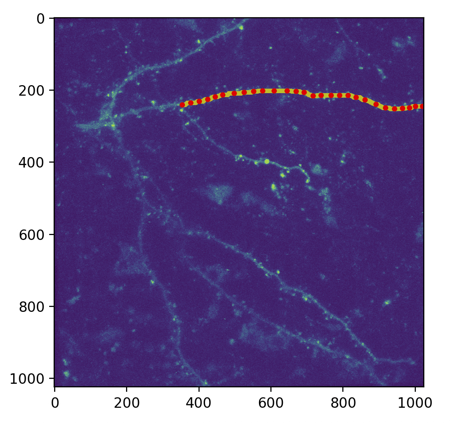

# Tracing

A package to trace filament like structures in 2D/3D images.

## Fiji Tracing


### Usage

All the neccesssary Fiji junk is in the [fijiScripts/](fijiScripts/) folder.

This currently calls Fiji from the command line with a pre-made Jython script `BobNeuriteTracer_v2_.py`.

Our ultimate goal is to implement our own A* tracing between successive points.

### Install

1) Fiji Tracing requires a system install of a lifeline version of the Fiji.app

    Download from [https://imagej.net/software/fiji/downloads#life-line-fiji-versions](https://imagej.net/software/fiji/downloads#life-line-fiji-versions)

    You want the one referred to as:

    ```
    Java 8, 2017 May 30, "Just prior to a sweeping update to nearly all components."
    ```

    You need to put the lifeline version of Fiji.app (20170530) in the following folder where `<user>` is your username on macOS

    ```
    <user>/Documents/fiji_old/Fiji.app
    ```

2) Please note, here we will be testing tracing by loading stack/annotations with PyMapManager.

```
    python -m venv tracing_env
    source tracing_env/bin/activate

    pip install -e .

    # this needs to be from
    # branch 'cudmore-fix-interface'
    pip install -e ../PyMapManager/.
```

### Getting started

In [tests/test_fiji_tracing_pymapmanager.py](tests/test_fiji_tracing_pymapmanager.py), run `test_tracing_pymapmanager()`.

Be sure to specify the corect path on your system.

```
tifPath = '/Users/cudmore/Sites/PyMapManager-Data/one-timepoint/rr30a_s0_ch2.tif'
```

The output should look like this. The red points are user defined control points. The yellow line/points is the full tracing coming back from Fiji - Simple Neurite Tracer.



